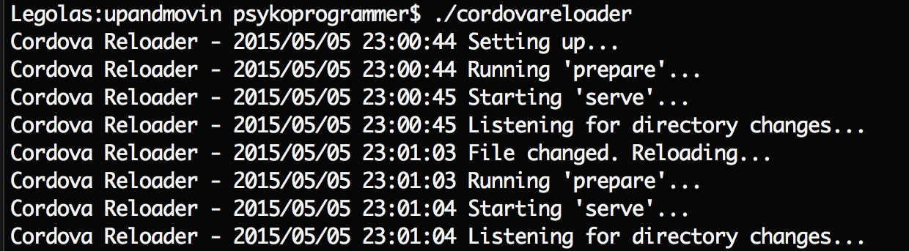

Cordova Live Reloader
=====================

Cordova Live Reloader is a small application that watches for file changes in your **www** folder of a Cordova application. When a change is detected assets are copied to their platform folders and serve is re-run. This is done by running the commands ```cordova prepare``` and ```cordova serve```. As such this tool only works if you have Cordova installed, and run it from a folder with a Cordova project.

As an example, if you have a Cordova project in the folder ```~/code/myproject```, and you copy the **cordovareloader** executable to that folder, running it will watch your *www* folder for changes, and when detected will prepare and re-run serve.



Running
-------
This repository contains builds for Mac OSX (10.10.3) and Windows 64-bit. Simply copy the correct executable to the directory that contains your Cordova application, then run the app. Then open your web browser to ```http://localhost:8000```.

License
-------
The MIT License (MIT)

Copyright (c) 2015 Adam Presley

Permission is hereby granted, free of charge, to any person obtaining a copy
of this software and associated documentation files (the "Software"), to deal
in the Software without restriction, including without limitation the rights
to use, copy, modify, merge, publish, distribute, sublicense, and/or sell
copies of the Software, and to permit persons to whom the Software is
furnished to do so, subject to the following conditions:

The above copyright notice and this permission notice shall be included in all
copies or substantial portions of the Software.

THE SOFTWARE IS PROVIDED "AS IS", WITHOUT WARRANTY OF ANY KIND, EXPRESS OR
IMPLIED, INCLUDING BUT NOT LIMITED TO THE WARRANTIES OF MERCHANTABILITY,
FITNESS FOR A PARTICULAR PURPOSE AND NONINFRINGEMENT. IN NO EVENT SHALL THE
AUTHORS OR COPYRIGHT HOLDERS BE LIABLE FOR ANY CLAIM, DAMAGES OR OTHER
LIABILITY, WHETHER IN AN ACTION OF CONTRACT, TORT OR OTHERWISE, ARISING FROM,
OUT OF OR IN CONNECTION WITH THE SOFTWARE OR THE USE OR OTHER DEALINGS IN THE
SOFTWARE.


